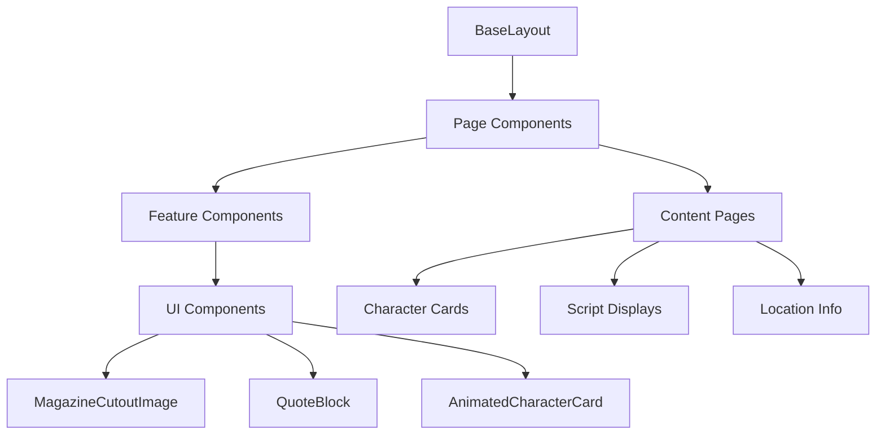
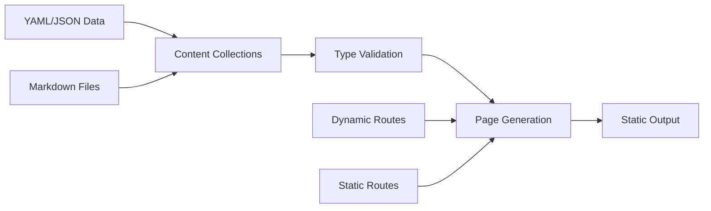
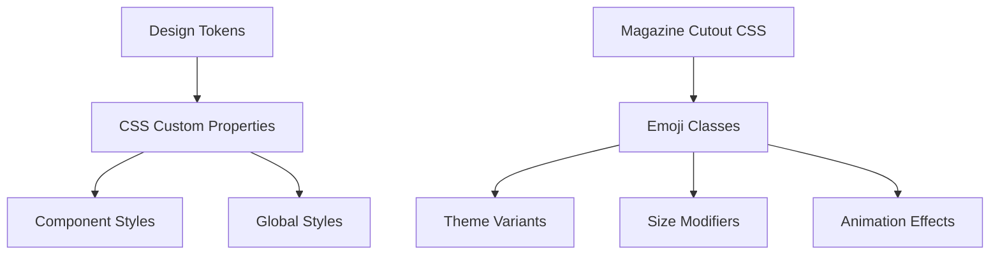
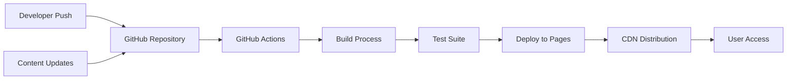

# 🏗️ Architecture Documentation - Testigos de Solarpunk

## Overview

Testigos de Solarpunk is a content-driven web application built with Astro.js, implementing a unique DIY magazine cutout aesthetic while maintaining high performance and accessibility standards.

## Technology Stack

### Core Framework

- **Astro.js 4.x** - Static Site Generator with island architecture
- **TypeScript** - Type safety and better developer experience
- **Vitest** - Unit and integration testing
- **Playwright** - E2E testing (future implementation)

### Styling & Design

- **CSS with Design Tokens** - Custom properties for theming
- **Magazine Cutout System** - 347-line custom CSS framework
- **Mobile-First Responsive Design** - Breakpoints: 320px, 768px, 1024px, 1280px, 1920px

### Content Management

- **Astro Content Collections** - Type-safe content management
- **YAML/JSON** - Character and location data
- **Markdown** - Script and resource content

## Project Structure

```
testigos-solarpunk/
├── src/
│   ├── pages/              # File-based routing
│   │   ├── index.astro     # Landing page
│   │   ├── proyecto.astro  # 3-phase strategy
│   │   ├── contenido/      # Content by phase
│   │   ├── comunidad.astro # Buyer personas
│   │   └── impacto.astro   # Impact metrics
│   ├── components/         # Reusable components
│   │   ├── layout/         # Layout components
│   │   └── [components]    # Feature components
│   ├── layouts/            # Page layouts
│   ├── content/            # Content collections
│   │   ├── characters/     # Character profiles
│   │   ├── scripts/        # Episode scripts
│   │   ├── locations/      # World locations
│   │   └── resources/      # Downloadable resources
│   ├── lib/                # Utilities and constants
│   ├── services/           # Business logic
│   ├── config/             # Configuration files
│   └── styles/             # Global styles
├── public/                 # Static assets
├── scripts/                # Build and utility scripts
└── tests/                  # Test suites
```

## Architecture Patterns

### 1. Component Architecture



### 2. Content Flow



### 3. Styling System



## Key Architectural Decisions

### 1. Static Site Generation

- **Decision**: Use Astro's static generation
- **Rationale**:
  - Optimal performance for content-driven site
  - SEO benefits
  - GitHub Pages compatibility
  - No server requirements

### 2. Magazine Cutout Aesthetic

- **Decision**: Custom CSS system with clip-path and transforms
- **Implementation**:
  ```css
  .emoji-cutout {
    clip-path: polygon(...);
    transform: rotate(var(--rotation));
    filter: drop-shadow(...);
  }
  ```
- **Rationale**: Authentic DIY aesthetic without heavy JavaScript

### 3. Content Collections

- **Decision**: Type-safe content management with Zod schemas
- **Benefits**:
  - Runtime validation
  - TypeScript integration
  - Structured content
  - Easy querying

### 4. AI Placeholder System

- **Decision**: Multi-service fallback with caching
- **Services**:
  1. placeholders.io (primary)
  2. abh.ai (fallback)
  3. placeholdr.ai (fallback)
  4. SVG generation (final fallback)
- **Features**:
  - In-memory caching
  - LRU eviction
  - Automatic optimization

## Data Flow

### 1. Page Request Flow

```
User Request → GitHub Pages → Static HTML → Client
                                    ↓
                              Load Assets
                                    ↓
                              Progressive Enhancement
```

### 2. Content Generation Flow

```
Content Files → Astro Build → Type Validation → Page Generation
       ↓                              ↓
  Collections                    Static Routes
       ↓                              ↓
  Type Safety                   HTML Output
```

### 3. Placeholder Generation Flow

```
Image Request → Cache Check → AI Service 1
                    ↓              ↓ (fail)
                 Cached        AI Service 2
                    ↓              ↓ (fail)
                 Return        AI Service 3
                                   ↓ (fail)
                              SVG Fallback
```

## Performance Optimizations

### 1. Build Time

- Content collections for efficient querying
- Static generation for all pages
- Image optimization during build

### 2. Runtime

- Progressive enhancement
- Lazy loading for images
- Minimal JavaScript footprint
- CSS-only animations

### 3. Caching Strategy

- In-memory placeholder cache
- 24-hour TTL for AI placeholders
- LRU eviction for memory management
- Service worker for offline support (PWA)

## Security Considerations

### 1. Content Security

- No user-generated content
- Static site (no server vulnerabilities)
- Validated content through schemas

### 2. External Dependencies

- rel="noopener noreferrer" for external links
- No sensitive data in client code
- Environment variables for configuration

### 3. PWA Security

- HTTPS only
- Service worker scope restrictions
- Cache versioning

## Testing Strategy

### 1. Unit Tests

- Utilities and helper functions
- Constants and configurations
- Component logic

### 2. Integration Tests

- Content loading and validation
- Page generation
- Navigation flow

### 3. E2E Tests (Future)

- User journeys
- Cross-browser compatibility
- Performance metrics

## Deployment Architecture



## Monitoring & Analytics

### 1. Performance Monitoring

- Lighthouse CI integration
- Web Vitals tracking
- Build size monitoring

### 2. Error Tracking

- Build-time error catching
- 404 page tracking
- Console error monitoring (future)

### 3. Usage Analytics

- Privacy-focused analytics
- Engagement metrics
- Content performance

## Future Architecture Considerations

### 1. Scalability

- Content API integration ready
- Incremental Static Regeneration (ISR) support
- Edge function compatibility

### 2. Internationalization

- i18n routing structure
- Localized content collections
- RTL support considerations

### 3. Advanced Features

- Real-time content updates
- User authentication (for future features)
- Community contributions

## Development Workflow

### 1. Local Development

```bash
npm run dev          # Start dev server
npm run check:all    # Run all checks
npm test            # Run tests
```

### 2. Content Creation

```bash
npm run new:character    # Create character
npm run audit:nav       # Check navigation
npm run check:a11y      # Accessibility audit
```

### 3. Build & Deploy

```bash
npm run build       # Production build
npm run preview     # Preview production
git push main       # Auto-deploy via Actions
```

## Conclusion

The architecture of Testigos de Solarpunk prioritizes:

- **Performance**: Static generation and optimization
- **Aesthetics**: Unique magazine cutout system
- **Maintainability**: Type safety and clear structure
- **Accessibility**: WCAG compliance focus
- **Scalability**: Ready for future growth

This architecture supports the project's mission to deliver engaging, sustainable content while maintaining technical excellence.
