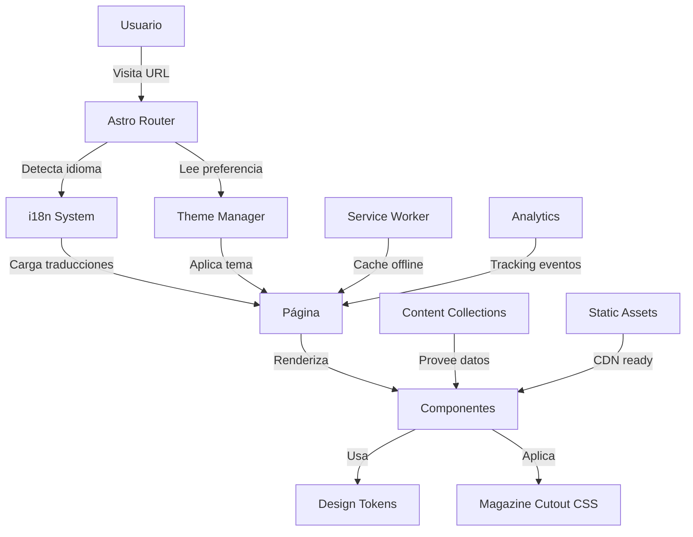
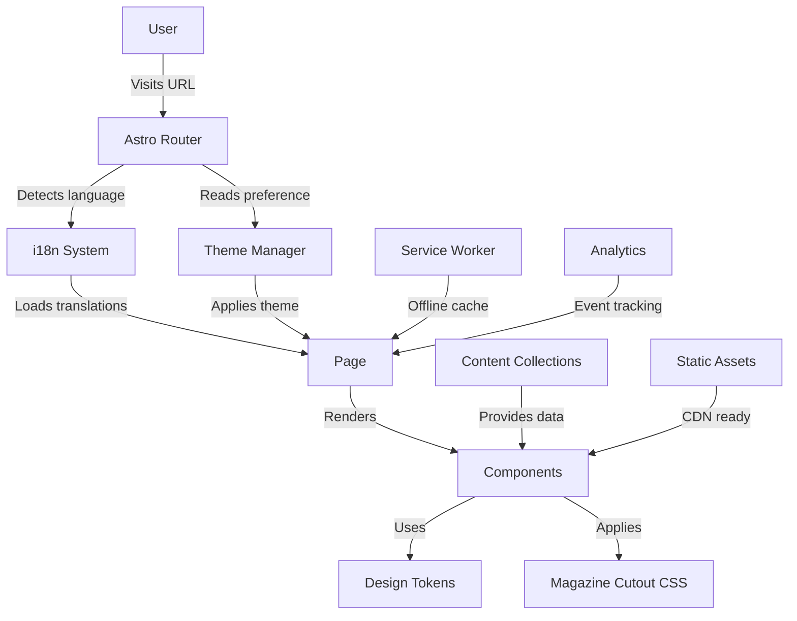

# Architecture Overview | Descripción de Arquitectura

<div align="center">

[Español](#arquitectura-español) | [English](#architecture-english)

</div>

## Arquitectura (Español)

### 📐 Estructura del Proyecto

```
testigos-solarpunk/
├── src/
│   ├── i18n/                    # Sistema de internacionalización
│   │   ├── config.ts            # Configuración de idiomas y rutas
│   │   ├── translations.ts      # Traducciones UI centralizadas
│   │   └── utils.ts            # Utilidades i18n (detectLanguage, etc.)
│   │
│   ├── utils/                   # Utilidades del sistema
│   │   ├── theme-manager.ts    # Gestor de temas con persistencia
│   │   └── cache-buster.ts     # Invalidación de cache en desarrollo
│   │
│   ├── components/
│   │   ├── [ComponentName].astro # Componentes con soporte i18n/themes
│   │   ├── ThemeSelector.astro  # Selector de temas triple
│   │   ├── LanguageToggle.astro # Toggle de idioma con sliding
│   │   └── README.md           # Catálogo de componentes
│   │
│   ├── layouts/
│   │   ├── BaseLayout.astro    # Layout principal con i18n/themes
│   │   └── UnifiedLayout.astro # Layout unificado (deprecated)
│   │
│   ├── pages/
│   │   ├── index.astro         # Redirect a idioma detectado
│   │   ├── 404.astro           # Página de error 404
│   │   ├── es/                 # Páginas en Español
│   │   │   ├── index.astro
│   │   │   ├── proyecto.astro
│   │   │   └── contenido/
│   │   └── en/                 # Páginas en Inglés
│   │       ├── index.astro
│   │       ├── project.astro
│   │       └── content/
│   │
│   ├── content/                # Contenido multilingüe
│   │   ├── config.ts           # Configuración de colecciones
│   │   ├── characters/         # Personajes del universo
│   │   ├── scripts/            # Guiones de sketches
│   │   └── [collection]/
│   │
│   └── styles/                 # Estilos globales
│       ├── critical.css        # CSS crítico inline
│       ├── global.css          # Estilos globales
│       ├── emoji-magazine-cutout.css # Sistema de emojis
│       └── newspaper-background.css  # Fondos temáticos
│
├── public/                     # Assets estáticos
│   ├── fonts/                  # Fuentes optimizadas
│   ├── images/                 # Imágenes optimizadas
│   ├── manifest.json           # PWA manifest
│   └── sw.js                   # Service Worker
│
├── scripts/                    # Scripts de build y utilidades
│   ├── generate-manifest.js    # Generador de manifest.json
│   ├── build-sw.js            # Constructor de Service Worker
│   ├── type-check.js          # Verificación de tipos
│   └── health-check/          # Scripts de health check
│
└── tests/                      # Suite de pruebas
    ├── unit/                   # Tests unitarios
    ├── integration/            # Tests de integración
    ├── e2e/                    # Tests end-to-end
    └── matrix/                 # Tests de matriz 6x
```

### 🔄 Flujo de Datos



### 🌐 Sistema i18n

#### Configuración Base

```typescript
// src/i18n/config.ts
export const languages = {
  es: 'Español',
  en: 'English',
} as const;

export const defaultLang: Language = 'es';
export const showDefaultLang = false; // URLs limpias para español

// Detección automática del idioma
export function detectLanguage(pathname: string): Language {
  const segments = pathname.split('/').filter(Boolean);
  const lang = segments[0];
  return lang === 'en' ? 'en' : 'es';
}
```

#### Enrutamiento Dinámico

- **URLs Español**: `/proyecto`, `/contenido/sketches`
- **URLs Inglés**: `/en/project`, `/en/content/sketches`
- **Detección automática** del idioma del navegador en `/`
- **Preservación de contexto** al cambiar idioma
- **SEO optimizado** con etiquetas hreflang

#### Traducciones

```typescript
// src/i18n/translations.ts
export const ui = {
  es: {
    'nav.home': 'Inicio',
    'nav.project': 'El Proyecto',
    'nav.content': 'Contenido',
    // ... más traducciones
  },
  en: {
    'nav.home': 'Home',
    'nav.project': 'The Project',
    'nav.content': 'Content',
    // ... más traducciones
  },
};
```

### 🎨 Sistema de Temas

#### Implementación

```typescript
// src/utils/theme-manager.ts
export type Theme = 'light' | 'dark' | 'auto';

export class ThemeManager {
  static setTheme(theme: Theme): void {
    // Persistencia en localStorage
    localStorage.setItem(STORAGE_KEY, theme);

    // Aplicar tema resuelto
    const resolved = this.resolveTheme(theme);
    document.documentElement.setAttribute('data-theme', resolved);
  }

  static resolveTheme(theme: Theme): 'light' | 'dark' {
    if (theme === 'auto') {
      const prefersDark = window.matchMedia(SYSTEM_QUERY).matches;
      return prefersDark ? 'dark' : 'light';
    }
    return theme;
  }
}
```

#### Design Tokens

```css
/* Variables por tema - src/styles/critical.css */
[data-theme='light'] {
  /* Colores principales */
  --color-eco-green: #4caf50;
  --color-solar-yellow: #ffc107;
  --color-comedy-purple: #673ab7;

  /* Fondos y superficies */
  --color-background: #fafafa;
  --color-surface: #ffffff;

  /* Texto */
  --color-text: #212121;
  --color-text-secondary: #757575;

  /* Magazine cutout */
  --cutout-shadow: rgba(0, 0, 0, 0.15);
  --tape-color: rgba(255, 193, 7, 0.7);
}

[data-theme='dark'] {
  /* Colores principales */
  --color-eco-green: #66bb6a;
  --color-solar-yellow: #ffd54f;
  --color-comedy-purple: #9575cd;

  /* Fondos y superficies */
  --color-background: #121212;
  --color-surface: #1e1e1e;

  /* Texto */
  --color-text: #ffffff;
  --color-text-secondary: #b0b0b0;

  /* Magazine cutout */
  --cutout-shadow: rgba(0, 0, 0, 0.5);
  --tape-color: rgba(255, 213, 79, 0.8);
}
```

### ✂️ Magazine Cutout System

#### Implementación CSS

```css
/* src/styles/emoji-magazine-cutout.css */
.emoji-cutout {
  position: relative;
  display: inline-block;

  /* Forma de recorte irregular */
  clip-path: polygon(
    5% 0%,
    95% 2%,
    100% 10%,
    98% 90%,
    92% 100%,
    8% 98%,
    0% 88%,
    2% 12%
  );

  /* Efecto de papel */
  background: radial-gradient(
    circle at 20% 50%,
    transparent 20%,
    rgba(255, 255, 255, 0.03) 21%
  );

  /* Sombra y profundidad */
  filter: drop-shadow(2px 2px 4px var(--cutout-shadow));

  /* Animación sutil */
  animation: flutter 6s ease-in-out infinite;
}

@keyframes flutter {
  0%,
  100% {
    transform: rotate(-1deg) translateY(0);
  }
  50% {
    transform: rotate(1deg) translateY(-2px);
  }
}
```

### 🚀 Optimización de Performance

#### Estrategias Implementadas

1. **Code Splitting por Ruta**

   - Separación automática por idioma
   - Lazy loading de componentes pesados
   - Dynamic imports para features opcionales

2. **Optimización de Assets**

   ```typescript
   // Imágenes con formatos modernos
   <picture>
     <source srcset="/image.avif" type="image/avif">
     <source srcset="/image.webp" type="image/webp">
     
   </picture>
   ```

3. **Critical CSS Inlining**

   - CSS crítico inline en `<head>`
   - Resto de CSS cargado asíncronamente
   - Eliminación de CSS no utilizado

4. **Service Worker Strategy**
   ```javascript
   // public/sw.js
   self.addEventListener('fetch', (event) => {
     // Network first, falling back to cache
     event.respondWith(
       fetch(event.request)
         .then((response) => {
           cache.put(event.request, response.clone());
           return response;
         })
         .catch(() => cache.match(event.request))
     );
   });
   ```

### 🔒 Seguridad

#### Headers de Seguridad

```typescript
// astro.config.mjs
export default defineConfig({
  vite: {
    server: {
      headers: {
        'X-Frame-Options': 'SAMEORIGIN',
        'X-Content-Type-Options': 'nosniff',
        'Referrer-Policy': 'strict-origin-when-cross-origin',
        'Permissions-Policy': 'camera=(), microphone=(), geolocation=()',
      },
    },
  },
});
```

#### Content Security Policy

```html
<meta
  http-equiv="Content-Security-Policy"
  content="default-src 'self'; 
               script-src 'self' 'unsafe-inline' https://www.googletagmanager.com; 
               style-src 'self' 'unsafe-inline' https://fonts.googleapis.com; 
               font-src 'self' https://fonts.gstatic.com;"
/>
```

---

## Architecture (English)

### 📐 Project Structure

```
testigos-solarpunk/
├── src/
│   ├── i18n/                    # Internationalization system
│   │   ├── config.ts            # Language and route configuration
│   │   ├── translations.ts      # Centralized UI translations
│   │   └── utils.ts            # i18n utilities (detectLanguage, etc.)
│   │
│   ├── utils/                   # System utilities
│   │   ├── theme-manager.ts    # Theme manager with persistence
│   │   └── cache-buster.ts     # Cache invalidation for development
│   │
│   ├── components/
│   │   ├── [ComponentName].astro # Components with i18n/theme support
│   │   ├── ThemeSelector.astro  # Triple theme selector
│   │   ├── LanguageToggle.astro # Language toggle with sliding
│   │   └── README.md           # Component catalog
│   │
│   ├── layouts/
│   │   ├── BaseLayout.astro    # Main layout with i18n/themes
│   │   └── UnifiedLayout.astro # Unified layout (deprecated)
│   │
│   ├── pages/
│   │   ├── index.astro         # Redirect to detected language
│   │   ├── 404.astro           # 404 error page
│   │   ├── es/                 # Spanish pages
│   │   │   ├── index.astro
│   │   │   ├── proyecto.astro
│   │   │   └── contenido/
│   │   └── en/                 # English pages
│   │       ├── index.astro
│   │       ├── project.astro
│   │       └── content/
│   │
│   ├── content/                # Multilingual content
│   │   ├── config.ts           # Collection configuration
│   │   ├── characters/         # Universe characters
│   │   ├── scripts/            # Sketch scripts
│   │   └── [collection]/
│   │
│   └── styles/                 # Global styles
│       ├── critical.css        # Critical inline CSS
│       ├── global.css          # Global styles
│       ├── emoji-magazine-cutout.css # Emoji system
│       └── newspaper-background.css  # Thematic backgrounds
│
├── public/                     # Static assets
│   ├── fonts/                  # Optimized fonts
│   ├── images/                 # Optimized images
│   ├── manifest.json           # PWA manifest
│   └── sw.js                   # Service Worker
│
├── scripts/                    # Build scripts and utilities
│   ├── generate-manifest.js    # manifest.json generator
│   ├── build-sw.js            # Service Worker builder
│   ├── type-check.js          # Type checking
│   └── health-check/          # Health check scripts
│
└── tests/                      # Test suite
    ├── unit/                   # Unit tests
    ├── integration/            # Integration tests
    ├── e2e/                    # End-to-end tests
    └── matrix/                 # 6x matrix tests
```

### 🔄 Data Flow



### 🌐 i18n System

#### Base Configuration

```typescript
// src/i18n/config.ts
export const languages = {
  es: 'Español',
  en: 'English',
} as const;

export const defaultLang: Language = 'es';
export const showDefaultLang = false; // Clean URLs for Spanish

// Automatic language detection
export function detectLanguage(pathname: string): Language {
  const segments = pathname.split('/').filter(Boolean);
  const lang = segments[0];
  return lang === 'en' ? 'en' : 'es';
}
```

#### Dynamic Routing

- **Spanish URLs**: `/proyecto`, `/contenido/sketches`
- **English URLs**: `/en/project`, `/en/content/sketches`
- **Automatic detection** of browser language at `/`
- **Context preservation** when switching languages
- **SEO optimized** with hreflang tags

#### Translations

```typescript
// src/i18n/translations.ts
export const ui = {
  es: {
    'nav.home': 'Inicio',
    'nav.project': 'El Proyecto',
    'nav.content': 'Contenido',
    // ... more translations
  },
  en: {
    'nav.home': 'Home',
    'nav.project': 'The Project',
    'nav.content': 'Content',
    // ... more translations
  },
};
```

### 🎨 Theme System

#### Implementation

```typescript
// src/utils/theme-manager.ts
export type Theme = 'light' | 'dark' | 'auto';

export class ThemeManager {
  static setTheme(theme: Theme): void {
    // Persistence in localStorage
    localStorage.setItem(STORAGE_KEY, theme);

    // Apply resolved theme
    const resolved = this.resolveTheme(theme);
    document.documentElement.setAttribute('data-theme', resolved);
  }

  static resolveTheme(theme: Theme): 'light' | 'dark' {
    if (theme === 'auto') {
      const prefersDark = window.matchMedia(SYSTEM_QUERY).matches;
      return prefersDark ? 'dark' : 'light';
    }
    return theme;
  }
}
```

#### Design Tokens

```css
/* Theme variables - src/styles/critical.css */
[data-theme='light'] {
  /* Main colors */
  --color-eco-green: #4caf50;
  --color-solar-yellow: #ffc107;
  --color-comedy-purple: #673ab7;

  /* Backgrounds and surfaces */
  --color-background: #fafafa;
  --color-surface: #ffffff;

  /* Text */
  --color-text: #212121;
  --color-text-secondary: #757575;

  /* Magazine cutout */
  --cutout-shadow: rgba(0, 0, 0, 0.15);
  --tape-color: rgba(255, 193, 7, 0.7);
}

[data-theme='dark'] {
  /* Main colors */
  --color-eco-green: #66bb6a;
  --color-solar-yellow: #ffd54f;
  --color-comedy-purple: #9575cd;

  /* Backgrounds and surfaces */
  --color-background: #121212;
  --color-surface: #1e1e1e;

  /* Text */
  --color-text: #ffffff;
  --color-text-secondary: #b0b0b0;

  /* Magazine cutout */
  --cutout-shadow: rgba(0, 0, 0, 0.5);
  --tape-color: rgba(255, 213, 79, 0.8);
}
```

### ✂️ Magazine Cutout System

#### CSS Implementation

```css
/* src/styles/emoji-magazine-cutout.css */
.emoji-cutout {
  position: relative;
  display: inline-block;

  /* Irregular cutout shape */
  clip-path: polygon(
    5% 0%,
    95% 2%,
    100% 10%,
    98% 90%,
    92% 100%,
    8% 98%,
    0% 88%,
    2% 12%
  );

  /* Paper effect */
  background: radial-gradient(
    circle at 20% 50%,
    transparent 20%,
    rgba(255, 255, 255, 0.03) 21%
  );

  /* Shadow and depth */
  filter: drop-shadow(2px 2px 4px var(--cutout-shadow));

  /* Subtle animation */
  animation: flutter 6s ease-in-out infinite;
}

@keyframes flutter {
  0%,
  100% {
    transform: rotate(-1deg) translateY(0);
  }
  50% {
    transform: rotate(1deg) translateY(-2px);
  }
}
```

### 🚀 Performance Optimization

#### Implemented Strategies

1. **Route-based Code Splitting**

   - Automatic separation by language
   - Lazy loading of heavy components
   - Dynamic imports for optional features

2. **Asset Optimization**

   ```typescript
   // Images with modern formats
   <picture>
     <source srcset="/image.avif" type="image/avif">
     <source srcset="/image.webp" type="image/webp">
     
   </picture>
   ```

3. **Critical CSS Inlining**

   - Critical CSS inline in `<head>`
   - Rest of CSS loaded asynchronously
   - Unused CSS elimination

4. **Service Worker Strategy**
   ```javascript
   // public/sw.js
   self.addEventListener('fetch', (event) => {
     // Network first, falling back to cache
     event.respondWith(
       fetch(event.request)
         .then((response) => {
           cache.put(event.request, response.clone());
           return response;
         })
         .catch(() => cache.match(event.request))
     );
   });
   ```

### 🔒 Security

#### Security Headers

```typescript
// astro.config.mjs
export default defineConfig({
  vite: {
    server: {
      headers: {
        'X-Frame-Options': 'SAMEORIGIN',
        'X-Content-Type-Options': 'nosniff',
        'Referrer-Policy': 'strict-origin-when-cross-origin',
        'Permissions-Policy': 'camera=(), microphone=(), geolocation=()',
      },
    },
  },
});
```

#### Content Security Policy

```html
<meta
  http-equiv="Content-Security-Policy"
  content="default-src 'self'; 
               script-src 'self' 'unsafe-inline' https://www.googletagmanager.com; 
               style-src 'self' 'unsafe-inline' https://fonts.googleapis.com; 
               font-src 'self' https://fonts.gstatic.com;"
/>
```

---

<div align="center">

[⬅️ Back to README](../README.md) | [Next: i18n Guide ➡️](./i18n.md)

</div>
